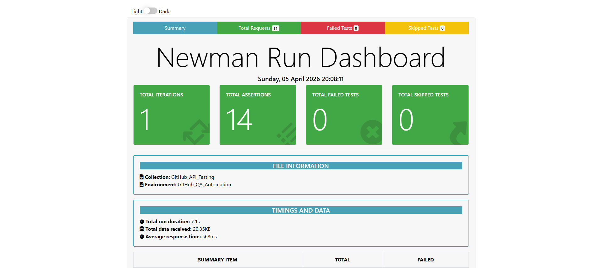

# GitHub API Automation Framework (OAuth 2.0)

A professional-grade API testing suite developed to validate the **GitHub REST API** using advanced automation techniques. This project demonstrates industry-standard SQA practices, including **Bearer Token (OAuth 2.0)** authorization, dynamic data chaining, and comprehensive resilience testing.

## 🚀 Key Automation Features

* **Security-First Architecture:** Utilized Postman Environment variables with secret-masking to handle sensitive credentials safely. Credentials are decoupled from test logic to ensure environment portability.
* **Dynamic Data Chaining:** Engineered JavaScript scripts to extract resource attributes from `POST` responses and inject them into subsequent `PATCH`, `GET`, and `DELETE` requests, achieving a zero-manual E2E execution flow.
* **Modular Test Design:** Organized the suite into logical layers:
    * `01_Authentication`: Validates token integrity and scope permissions.
    * `02_Repository_Management`: Handles the full CRUD lifecycle of a repository.
    * `03_Negative_Scenarios`: Validates system resilience against bad data and conflicts.
* **Automated Teardown:** Implemented a **recursive cleanup script** using `postman.setNextRequest` to purge test artifacts and ensure environment idempotency after every run.

## 🛠️ Tech Stack

* **Tooling:** Postman
* **Runner:** Newman CLI
* **Scripting:** JavaScript (Postman Sandbox)
* **Reporting:** Newman htmlextra
* **Auth:** OAuth 2.0 (Bearer Tokens)

## 🐞 Bug Discovery Log: Non-Deterministic Type Validation

During negative testing, an inconsistent validation pattern was identified in the repository creation endpoint:
* **Issue:** The API intermittently accepts a Boolean `true` for a String-based `name` field.
* **Observed Behavior:** The system occasionally performs implicit coercion (`201 Created`) and other times correctly enforces the schema (`422 Unprocessable Entity`).
* **QA Impact:** This highlights a potential inconsistency in schema enforcement across API nodes or clusters. The test suite was designed to flag these non-deterministic states for further investigation.

## 📊 Test Execution Results

To maintain security compliance and prevent the exposure of active OAuth 2.0 tokens, raw HTML reports are excluded. Below is a summary of the automated test execution results.

### Newman CLI Summary
The following screenshot confirms the successful execution of all test suites, including authentication, CRUD operations, and boundary-value negative scenarios.



### Automated Test Pass Rate
* **Total Assertions:** 14
* **Failed:** 0
* **Success Rate:** 100%

## 📥 Installation & Usage

1.  **Clone the Repository:**
    ```bash
    git clone [https://github.com/thedatafae/github-api-automation-framework.git](https://github.com/thedatafae/github-api-automation-framework.git)
    ```

2.  **Import to Postman:**
    * Import the collection: `collections/GitHub_API_Testing.json`
    * Import the environment: `environments/GitHub_QA_Env.json`

3.  **Set Variables:**
    Update the `access_token` in your Postman environment with a valid GitHub Personal Access Token (PAT).

4.  **Run via CLI (Newman):**
    ```bash
    newman run collections/GitHub_API_Testing.json -e environments/GitHub_QA_Env.json -r cli,htmlextra
    ```
